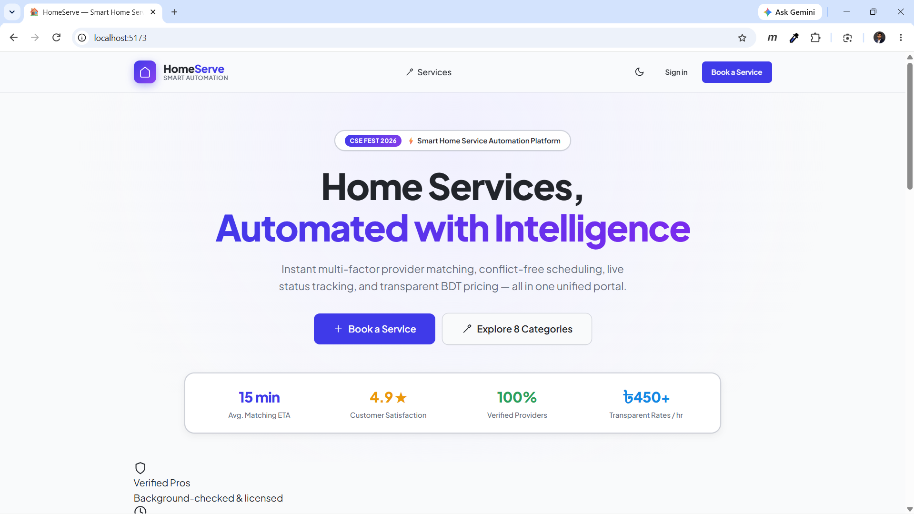
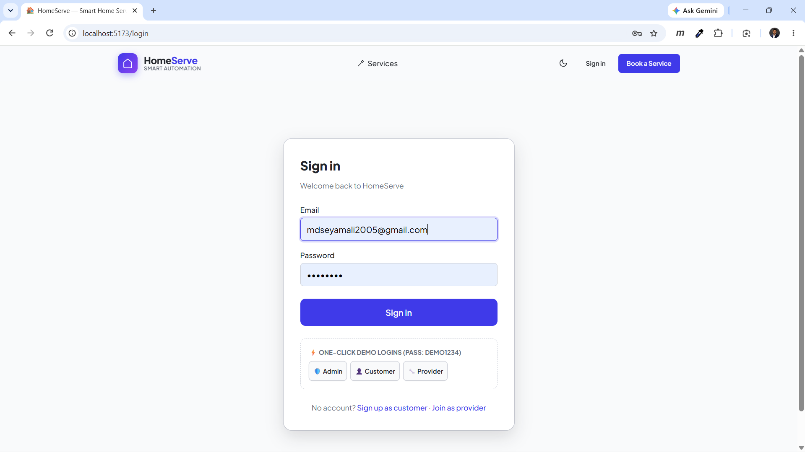
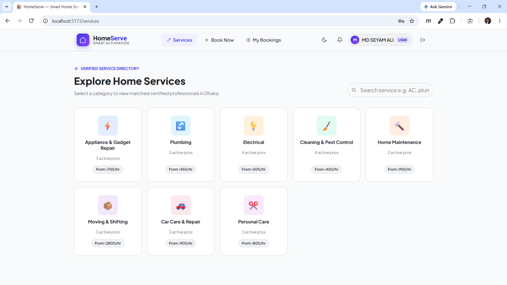
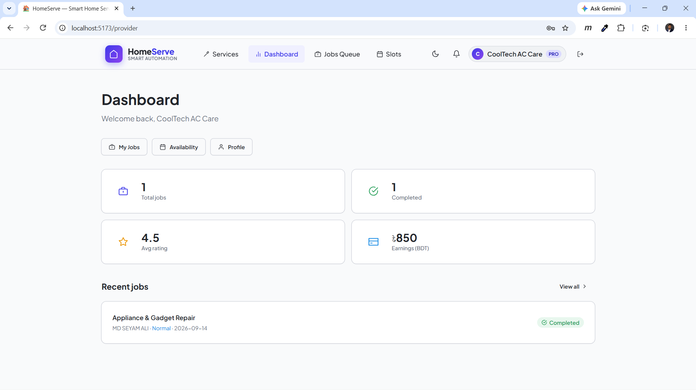
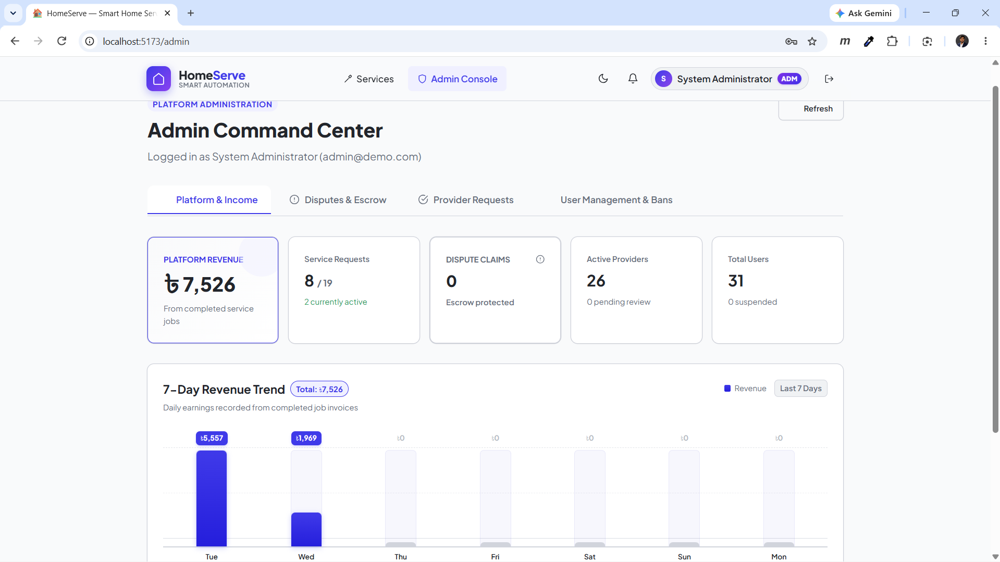

# 🏠 Smart Home Service Automation
### Next-Gen On-Demand Home Services & Automated Dispatch Marketplace

[](https://www.python.org/)
[](https://fastapi.tiangolo.com/)
[](https://react.dev/)
[](https://vitejs.dev/)
[](https://www.sqlite.org/)
[](https://www.postgresql.org/)

---

## 📋 Table of Contents
- [Project Overview](#-project-overview)
- [📸 Application Showcase & Screenshots](#-application-showcase--screenshots)
  - [1. Website First Interface (Landing Page)](#1-website-first-interface-landing-page)
  - [2. Sign-In & Authentication Page](#2-sign-in--authentication-page)
  - [3. Customer Dashboard & Request Tracking](#3-customer-dashboard--request-tracking)
  - [4. Service Provider Dashboard & Availability](#4-service-provider-dashboard--availability)
  - [5. Admin Console & Arbitration Command Center](#5-admin-console--arbitration-command-center)
- [✨ Key Features & Capabilities](#-key-features--capabilities)
- [🏗️ Technical Architecture & Design Decisions](#️-technical-architecture--design-decisions)
- [⚡ Quick Start Guide (One-Click Run)](#-quick-start-guide-one-click-run)
- [🛠️ Manual Setup & Installation](#️-manual-setup--installation)
- [🔑 Demo Accounts & Role Access](#-demo-accounts--role-access)
- [📡 API Endpoints Overview](#-api-endpoints-overview)
- [🖼️ How Screenshots Are Embedded in this Markdown](#️-how-screenshots-are-embedded-in-this-markdown)

---

## 🌟 Project Overview

**Smart Home Service Automation** is a production-grade, two-sided on-demand marketplace connecting homeowners with verified, highly skilled service professionals across 8 core domestic categories. Built for the **BAUST CSE FEST 2026 Hackathon**, this platform replaces friction-heavy traditional phone bookings with intelligent matching, instant slot reservations, transparent escrow-protected payments, and live real-time status tracking.

### Core Value Propositions:
- **Intelligent Dispatch Engine**: Heuristic weighted matching based on Haversine geographic distance, customer ratings, current workload, and urgency level.
- **Escrow-Protected Guarantee**: Payments remain held securely in platform escrow when work is marked complete until the customer reviews and releases payment or disputes the service.
- **O(1) In-Memory Double Booking Shield**: High-speed booking conflict prevention ensures no provider can ever be booked twice for the same time window.
- **Zero-Dependency Security**: Stdlib-powered PBKDF2-HMAC-SHA256 password hashing with individual salt and cryptographically signed HMAC-SHA256 stateless bearer tokens (no external JWT bloat).
- **Contemporary Design System**: Built with modern OKLCH color spaces, dynamic glassmorphism, responsive mobile layouts, and zero external CSS runtime overhead.

---

## 📸 Application Showcase & Screenshots

Here is a visual walkthrough of the platform across all primary user roles and workflows.

---

### 1. Website First Interface (Landing Page)
The front-facing landing portal welcomes users with intuitive category discovery, service highlights, a step-by-step workflow overview, and quick one-click demo login buttons.

<p align="center">
  
</p>

**Key Highlights:**
- **Category Grid**: Instant access to 8 service categories (Plumbing, Electrical, Appliance Repair, Cleaning, etc.).
- **How It Works Flow**: Visual step-by-step guidance for new customers.
- **Fast-Track Login**: Direct one-click login triggers for testing customer, provider, and admin profiles without manual registration.

---

### 2. Sign-In & Authentication Page
A secure, unified entry point offering dual authentication flows for customers and verified service providers.

<p align="center">
  
</p>

**Key Highlights:**
- **Role-Based Redirection**: Dynamically redirects users to their appropriate portal (Customer View, Provider Workspace, or Admin Console).
- **Demo Quick-Fill Credentials**: Built-in credential cards allow evaluators to log in instantly.
- **Separate Registration Routes**: Tailored registration forms for customers (home address, phone) and service providers (skills, category, hourly rate, bio).

---

### 3. Customer Dashboard & Request Tracking
Customers enjoy a transparent control room where they can monitor active bookings, review cost breakdowns, inspect provider ETAs, and authorize escrow payouts.

<p align="center">
  
</p>

**Key Highlights:**
- **Live Timeline Tracking**: 5-second polling status progression from `Pending` → `Accepted` → `In Progress` → `Work Done` → `Completed`.
- **Escrow Release / Dispute Center**: Customers can either click **"Release Payment"** to confirm satisfactory service or **"Report Issue / Dispute"** with photo proof for admin arbitration.
- **Automated Invoices**: Complete breakdown including base service cost, urgency surcharge, platform service fee (5%), and government VAT (15%).
- **Interactive Review System**: 5-star rating and written review submission upon service completion.

---

### 4. Service Provider Dashboard & Availability
Service providers have an end-to-end command center to manage incoming job offers, navigate active assignments, and publish or close booking slots.

<p align="center">
  
</p>

**Key Highlights:**
- **KPI Metrics**: Real-time summary of total completed jobs, pending dispatch requests, active customer ratings, and net revenue.
- **Interactive Job Flow**: Step-by-step state transitions with one-click actions: "Accept Job", "Arrived at Location", "Start Work", and "Mark Work Done".
- **Visual Schedule Manager**: 14-day rolling slot calendar to toggle open/closed availability with purple badges locking already-booked slots.
- **Customer Problem Inspection**: Direct access to customer-uploaded problem photos, location details, and urgency tags (Normal vs. Emergency).

---

### 5. Admin Console & Arbitration Command Center
Platform administrators monitor platform health, arbitrate disputed escrow claims, verify newly onboarded service providers, and analyze 7-day revenue trends.

<p align="center">
  
</p>

**Key Highlights:**
- **7-Day Revenue Trend Graph**: High-resolution financial chart visualizing daily platform revenue, baseline indicators, and peak transaction badges.
- **Escrow & Dispute Arbitration Portal**: Complete dispute management modal with full-screen inspection of customer proof photos, case notes, and arbitration triggers (**Release to Provider** or **Refund Customer**).
- **Provider Approval Queue**: Verify and approve or reject provider registrations before they appear in public search.
- **User Governance**: One-click ban and unban controls to protect platform integrity.

---

## ✨ Key Features & Capabilities

| Feature | Description |
|---|---|
| **Intelligent Provider Matching** | Dynamic algorithm scoring providers using formula: `Score = w_dist × (1 − norm_dist) + w_rating × norm_rating + w_load × (1 − norm_load)`. In Emergency mode, distance and load are heavily prioritized. |
| **Escrow Financial Protection** | When work completes, funds are held in platform escrow (`৳650 Held in Escrow`). No provider payout occurs without customer authorization or admin verdict. |
| **O(1) Booking Conflict Shield** | Memory-resident hash map `(provider_id, date, slot) → request_id` provides sub-millisecond slot collision detection, restored on server restart. |
| **Comprehensive Dispute Lifecycle** | Dissatisfied customers can freeze escrow and provide photographic evidence. Admins review claims with side-by-side evidence inspection. |
| **Live Multi-Channel Notifications** | Automatic notification fan-out for booking creation, status progressions, dispute filings, and payment settlements. |
| **Dark / Light Theme Engine** | Pure OKLCH CSS variables offering fluid dark mode transitions with zero external CSS framework footprint. |

---

## 🏗️ Technical Architecture & Design Decisions

### Tech Stack Matrix

```
┌─────────────────────────────────────────────────────────────┐
│                       CLIENT TIER                           │
│     React 19  •  Vite 8  •  React Router DOM v7  •  CSS3   │
│           (OKLCH Tokens, Dark Mode, Glassmorphism)          │
└──────────────────────────────┬──────────────────────────────┘
                               │ JSON / REST API (Vite Proxy)
                               ▼
┌─────────────────────────────────────────────────────────────┐
│                       SERVER TIER                           │
│           FastAPI (Python 3.11+)  •  Uvicorn Server         │
│    Stdlib Security (PBKDF2-HMAC-SHA256 + Stateless Tokens)  │
│        Weighted Matching Engine  •  State Machine Flow       │
└──────────────────────────────┬──────────────────────────────┘
                               │ SQLAlchemy 2.0 ORM
                               ▼
┌─────────────────────────────────────────────────────────────┐
│                      DATABASE TIER                          │
│     SQLite (Local default)  /  PostgreSQL (Enterprise env)   │
└─────────────────────────────────────────────────────────────┘
```

### Key Technical Decisions:
1. **Lightweight Native Security**: Rather than relying on heavyweight JWT libraries, authentication leverages Python's built-in `hashlib.pbkdf2_hmac` with 260,000 iterations and per-user random cryptographic salt.
2. **Postgres Ready**: Configured through a single environment variable `DATABASE_URL`. If unset, seamlessly falls back to local SQLite (`backend/smart_home.db`).
3. **No-CORS Vite Proxy**: During development, Vite forwards all `/api/*` network requests directly to `http://localhost:8000`, removing browser CORS header hassles.

---

## ⚡ Quick Start Guide (One-Click Run)

The project includes one-command startup scripts that automatically set up the Python virtual environment, install dependencies, seed demo accounts, and launch both backend and frontend servers simultaneously.

### 🪟 Windows Users:
Run directly from your project directory:
```bat
cd d:\1_project\smart-home-service-automation
run.bat
```
*(Or double-click `smart-home-service-automation\run.bat` in Windows File Explorer)*

### 🐧 Linux / macOS Users:
```bash
cd d:\1_project\smart-home-service-automation
bash run.sh
```

Once running, visit:
- **Web Application**: [http://localhost:5173](http://localhost:5173)
- **FastAPI Interactive Docs**: [http://localhost:8000/docs](http://localhost:8000/docs)
- **Backend Health Check**: [http://localhost:8000/api/health](http://localhost:8000/api/health)

---

## 🛠️ Manual Setup & Installation

If you prefer launching the backend and frontend separately in distinct terminals:

### Step 1: Backend Setup (Terminal 1)
```powershell
cd d:\1_project\smart-home-service-automation\backend

# 1. Create virtual environment
python -m venv .venv

# 2. Activate virtual environment
.venv\Scripts\activate       # Windows PowerShell
# source .venv/bin/activate  # Linux / macOS

# 3. Install backend dependencies
pip install -r requirements.txt

# 4. Seed database with 24 providers & 3 demo customers
python seed.py

# 5. Start Uvicorn API server
uvicorn main:app --reload --port 8000
```

### Step 2: Frontend Setup (Terminal 2)
```powershell
cd d:\1_project\smart-home-service-automation\frontend

# 1. Install npm packages
npm install

# 2. Start Vite development server
npm run dev
```

---

## 🔑 Demo Accounts & Role Access

For evaluation, the database comes pre-seeded with ready-to-use accounts across all roles.  
**Universal Password for all demo accounts:** `demo1234`

| Role | Name | Email | Default Dashboard |
|---|---|---|---|
| **Platform Admin** | System Admin | `admin@demo.com` | `/admin` (Arbitration & Stats) |
| **Customer** | Rahat Ahmed | `customer1@demo.com` | `/requests` (My Requests & Booking) |
| **Customer** | Nusrat Jahan | `customer2@demo.com` | `/requests` (My Requests & Booking) |
| **Customer** | Tanvir Hasan | `customer3@demo.com` | `/requests` (My Requests & Booking) |
| **Provider (Plumbing)** | Karim Plumbing | `karim.plumbing.services@demo.com` | `/provider/dashboard` |
| **Provider (Electrical)** | PowerLine Electrical | `powerline.electrical@demo.com` | `/provider/dashboard` |
| **Provider (Appliances)** | Rahim Electronics | `rahim.electronics@demo.com` | `/provider/dashboard` |
| **Provider (Cleaning)** | CleanSweep BD | `cleansweep.bd@demo.com` | `/provider/dashboard` |

*(Detailed roster of all 24 category specialists is documented in `demo_accounts.md`)*

---

## 📡 API Endpoints Overview

The backend provides a RESTful interface documented with Swagger UI at `http://localhost:8000/docs`:

### Authentication (`/api/auth`)
- `POST /api/auth/signup/customer` — Register customer account
- `POST /api/auth/signup/provider` — Register provider with business profile
- `POST /api/auth/login` — Authenticate and receive bearer token
- `GET /api/auth/me` — Retrieve active session profile
- `GET /api/auth/demo-accounts` — List pre-seeded demo credentials

### Service Requests & Booking (`/api/service-requests`)
- `POST /api/service-requests` — Create booking with slot reservation
- `GET /api/service-requests` — Fetch filtered list of requests (role-aware)
- `GET /api/service-requests/{id}` — Retrieve detailed booking with timeline
- `POST /api/service-requests/{id}/status` — Advance state machine
- `POST /api/service-requests/{id}/release-payment` — Confirm work and release escrow
- `POST /api/service-requests/{id}/dispute` — Freeze escrow and submit dispute ticket
- `POST /api/service-requests/{id}/rate` — Submit customer star rating and review

### Admin & Governance (`/api/admin`)
- `GET /api/admin/stats` — Retrieve 7-day revenue trend and platform metrics
- `GET /api/admin/disputes` — List pending dispute arbitration cases
- `POST /api/admin/disputes/{id}/resolve` — Arbitrate dispute (Release vs Refund)
- `GET /api/admin/providers/pending` — Provider approval queue
- `POST /api/admin/providers/{id}/approve` — Approve provider application
- `POST /api/admin/users/{id}/ban` — Ban or unban platform user

---

## 🖼️ How Screenshots Are Embedded in this Markdown

To embed local screenshots cleanly in any Markdown or GitHub document, use relative paths pointing directly to where the image files reside:

### 1. Standard Markdown Syntax:
```markdown

```

### 2. Enhanced HTML Centered Syntax (with width control & styling):
```html
<p align="center">
  
</p>
```

### Why this works seamlessly in this directory:
- Because the images (`website_first_interfage.png`, `sign_in_page.png`, `customer_dashbord.png`, `service_provider_dashbord.png`, `admin_console.png`) are located in the same directory (`d:\1_project\`) as this `README.md`, referencing them with `./<filename>.png` allows any Markdown reader, VS Code previewer, or GitHub repository root to display them instantly without needing broken external links or hosting services!
